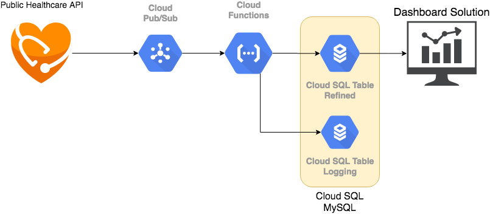

# gcp-usa-census-healthcare

Repository to test GCP features using healthcare public dataset from USA goverment.

## Getting Started

[wip]

### Architecture



### Prerequisites

[wip]

```
Access to the GCP;
```

### Installing

[wip]

## Running the tests

[wip]

### Break down into end to end tests

[wip]

### And coding style tests

[wip]

## Deployment

[wip]

## Built With

* [Google Cloud Platform](https://cloud.google.com/) - Is a suite of cloud computing services that runs on the same infrastructure that Google uses internally for its end-user products,
* [Data Pub/Sub](https://cloud.google.com/pubsub/) - Messaging and ingestion for event-driven systems and streaming analytics.
* [Cloud Function](https://cloud.google.com/functions) -  Scalable pay-as-you-go functions as a service (FaaS) to run your code with zero server management. 
* [Cloud SQL](https://cloud.google.com/sql/) - Fully managed relational database service for MySQL, PostgreSQL, and SQL Server.
* (optional) [Dataflow](https://cloud.google.com/dataflow) - Unified stream and batch data processing that's serverless, fast, and cost-effective.

## Contributing
[wip]

## Versioning

[wip]

## Authors

* **Lucian Lorens** - *Initial work* - [lucianlorens](https://github.com/lucianlorens)


## License

:construction: [wip] :construction:

## Acknowledgments

[wip]
